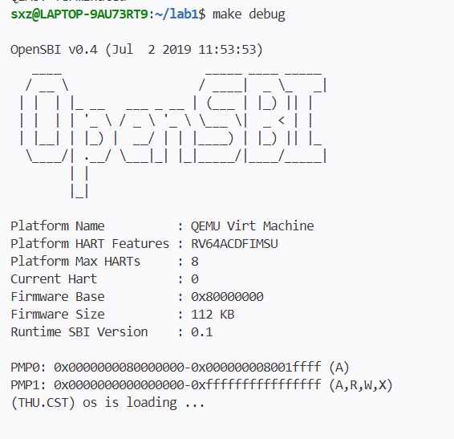

# 操作系统实验报告

## 实验基本信息

| 项目 | 内容 |
|------|------|
| **实验名称** | Lab 1：比麻雀更小的麻雀（最小可执行内核） |
| **小组成员** | 独立完成（石欣哲-2412896） |
| **完成日期** | 2026-09-30 |

### 小组分工

| 成员 | 负责的练习/模块 |
|------|----------------|
| 本人 | 练习1、练习2、实验报告撰写 |

---

## 一、实验目的

1. 理解 RISC-V 计算机从加电到执行内核第一条指令的完整启动流程。
2. 掌握链接脚本、交叉编译、OpenSBI 引导、QEMU 模拟器的基本使用方法。
3. 熟悉 GDB 调试工具，能够单步跟踪内核启动过程。
4. 练习使用 AI 编程工具辅助操作系统实验。

---

## 二、实验环境

| 成员 | AI 编程工具 | 底层模型 | 备注 |
|------|------------|---------|------|
| 本人 | Cline（VS Code 插件） | DeepSeek-v4-flash | WSL Ubuntu 24.04，VS Code 连接 WSL |

**说明：**
- AI 编程工具：Cline，运行在 VS Code 的 WSL 远程窗口中。
- 底层模型：DeepSeek-v4-flash，通过 API Key 接入。
- 交叉编译器：riscv64-unknown-elf-gcc 13.2.0。

- 模拟器：qemu-system-riscv64 4.1.1（内置 OpenSBI v0.4）。

---

## 三、实验整体逻辑分析

### 3.1 本章节的逻辑主线

本章核心是构建一个最小可执行内核，使其在 QEMU 上从复位运行到输出一行字符。主线围绕“如何让内核在 RISC-V 模拟器上启动并具备最基本的输出能力”展开。

### 3.2 功能的逐步实现

1. **链接脚本** `tools/kernel.ld`：指定入口 `kern_entry`，加载地址 `0x80200000`，定义段布局。
2. **构建系统** `Makefile`：交叉编译、链接，生成 `bin/kernel` 和 `bin/ucore.img`。
3. **汇编入口** `kern/init/entry.S`：设置启动栈，跳转到 C 入口。
4. **C 入口** `kern/init/init.c`：清 `.bss`，调用 `cprintf` 输出，进入死循环。
5. **输出链**：`cprintf → vprintfmt → cons_putc → sbi_console_putchar → ecall`，最终由 OpenSBI 输出到控制台。

顺序原因：C 代码需要合法栈，所以先建栈；`.bss` 需清零，所以 `kern_init` 第一件事是 `memset`；输出是唯一可观测结果，所以先打通控制台链。

---

## 四、实验内容与实现

### 核心模块分析

（本实验无代码编写任务，以下为对现有代码的理解）

- **`entry.S`**：`la sp, bootstacktop` 建立 8KB 启动栈（`0x80203000`）；`tail kern_init` 跳转到 C，不写 `ra`，保留 `a0`（hartid）、`a1`（DTB）。
- **`init.c`**：`memset(edata, 0, end - edata)` 清 `.bss`；`cprintf` 打印启动信息；`while(1)` 停住。
- **`console.c`**：`cons_putc` 调用 `sbi_console_putchar`；其余函数为空或未实现。
- **`sbi.c`**：`sbi_call` 用内联汇编执行 `ecall`，功能号放 `a7`，参数放 `a0~a2`。
- **`stdio.c`**：`cprintf`/`vcprintf` 封装 `vprintfmt`，`cputch` 为输出回调。
- **`printfmt.c`**：格式化解引擎，通过 `putch` 与设备解耦。
- **`string.c`**：提供 `memset`、`strnlen` 等，实际仅这两个被用到。
- **`kernel.ld`**：`.text` 起始 `0x80200000`，`.data` 含 8KB 启动栈，`.bss` 为空。
- **`Makefile`**：`-mcmodel=medany`，`--gc-sections` 回收未用函数；`qemu`/`debug` 使用 `-kernel` 加载。

---

### 练习1：理解内核启动中的程序入口操作

**负责人：** 本人

- **`la sp, bootstacktop`**：伪指令，展开为 `auipc+addi`，将 `sp` 设为启动栈顶 `0x80203000`。OpenSBI 不保证 `sp` 有效，C 代码需要合法栈。
- **`tail kern_init`**：尾调用，跳转到 `kern_init` 且不写 `ra`。`kern_init` 为 `noreturn`，无需返回点；不破坏 `a0/a1`。

---

### 练习2：使用 GDB 验证启动流程

**负责人：** 本人

**调试过程**：
1. `make debug` 启动 QEMU 并暂停。
2. `make gdb` 连接，停在 `0x1000`。
3. `x/10i $pc` 查看复位指令，共 5 条有效指令。
4. `info registers`：复位现场 `pc=0x1000`、`sp=0`、`a0=0`、`a1=0`。
5. `b *0x80200000`，`c` 命中 `kern_entry`。此时寄存器：`a0=0`，`a1=0x82200000`（DTB），`sp=0x8001bd80`，`pc=0x80200000`。
6. `si` 执行 `la` 后：`sp=0x80203000`，`pc=0x80200004`。
7. 再 `si` 后：`pc=0x8020000a <kern_init>`，`sp`、`a0`、`a1` 未被破坏。

**问题回答**：
RISC-V 加电后最初指令位于 **`0x1000`**（复位地址）。QEMU 4.1.1 下复位向量共 5 条：
- `auipc t0, 0x0`：取得复位桩自身基址 `0x1000`；
- `addi a1, t0, 32`：a1 = `0x1020`，指向 ROM 中 DTB 地址的存放位置；
- `csrr a0, mhartid`：读取 hart ID 存入 a0；
- `ld t0, 24(t0)`：从 `0x1018` 取出下一级固件入口（OpenSBI 的 `0x80000000`）；
- `jr t0`：跳转到 OpenSBI。


---

### 最终提示词与实现迭代过程

**负责人：** 本人

> 说明：lab1 无代码编写任务，以下为与 AI 交互的提示词及调试迭代过程。

#### 练习1 提示词

```
请阅读当前项目中的 kern/init/entry.S 文件，解释以下两条指令的作用和目的：
1. la sp, bootstacktop
2. tail kern_init
请结合 RISC-V 汇编和操作系统启动流程说明，不要只翻译字面意思。
```

**迭代过程：**

1. 向 Cline 提问后，Cline 读取 `entry.S`、`kernel.ld`、反汇编文件，给出伪指令展开、栈地址、寄存器保留等分析。
2. 本人核对反汇编，确认 `la` 展开为 `auipc+addi`，`tail` 松弛为 `j kern_init`。
3. 整理练习1答案，会话记录保存为 `会话记录/lab1_exercise1.md`。

#### 练习2 提示词

```
我正在做 lab1 练习2：用 GDB 跟踪 QEMU 从加电到跳转 0x80200000 的过程。以下是我的观察结果：

1. GDB 连上后停在 0x1000，反汇编显示（QEMU 4.1.1）：
   auipc t0,0x0
   addi a1,t0,32
   csrr a0,mhartid
   ld t0,24(t0)
   jr t0
2. 在 0x80200000 设断点后继续运行，命中 kern_entry。
   此时寄存器：a0=0（hartid），a1=0x82200000（DTB），sp=0x8001bd80，pc=0x80200000。
3. 单步执行 la sp, bootstacktop 后，sp=0x80203000。
4. 再单步执行 tail kern_init 后，pc=0x8020000a <kern_init>。

请帮我：
1. 解释 0x1000 处这几条指令各自完成了什么功能。
2. 解释为什么 OpenSBI 跳转到内核时 sp 是无效的，以及 entry.S 为什么必须自己设栈。

```

**迭代过程：**

1. 本人手动操作 GDB，记录上述 4 条观察结果。
2. 将观察结果发给 Cline，请求解释 `0x1000` 复位向量与 `sp` 无效原因。
3. Cline 给出完整分析，整理为 `会话记录/lab1_exercise2.md`。
4. Makefile 中 `-device loader` 改为 `-kernel`、GDB 命令序列，由本人与Cline讨论后完成


## 五、测试与验证

**编译与运行结果：**

```bash
$ make
+ cc kern/init/entry.S
+ cc kern/init/init.c
...
riscv64-unknown-elf-objcopy bin/kernel --strip-all -O binary bin/ucore.img

$ make qemu
OpenSBI v0.4
...
(THU.CST) os is loading ...
```

内核成功启动并输出 `(THU.CST) os is loading ...`。

**测试截图：**



---

## 六、实验总结与收获

### 对操作系统的理解

**本实验重要知识点与 OS 原理对照：**

| 本实验知识点 | OS 原理 | 关系与差异 |
|---|---|---|
| 启动栈（静态 8KB） | 内核栈管理 | 只有启动 hart 的栈，无每进程栈 |
| `la` PC 相对寻址 | 重定位/位置无关 | 静态链接固定物理地址 |
| `tail` 不写 `ra` | 函数调用约定 | 单向移交，依赖 `noreturn` |
| `.bss` 清零 | 段加载 | 由内核自己完成，非加载器 |
| 固定加载地址 0x80200000 | 内存布局 | 无 MMU、无虚拟地址 |
| `ecall` 调 SBI | 系统调用/特权级 | 内核→固件，非用户→内核 |
| `printfmt` 回调 | 设备无关 I/O | 无缓冲、无中断驱动 |
**OS 原理中重要但本实验未覆盖的知识点：**
- 中断/异常处理（trap 框架）
- 时钟中断与抢占
- 物理内存管理与分页
- 进程/线程与调度
- 用户态与系统调用
- 内存保护与隔离
- 设备驱动与中断 I/O
- 并发与同步
- 文件系统与持久存储


### AI 协作开发的经验

- 使用 Cline 辅助阅读代码、分析启动流程，提高了效率。
- 关键点：AI 生成的解释需要自己验证（如反汇编确认 `la` 的展开、GDB 实际观察寄存器变化）。
- 遇到 Makefile 兼容性问题时，AI 能快速给出修改方案，但需要自己测试确认。
- 完整保留了与 AI 的对话记录，便于复盘和提交作业。

---